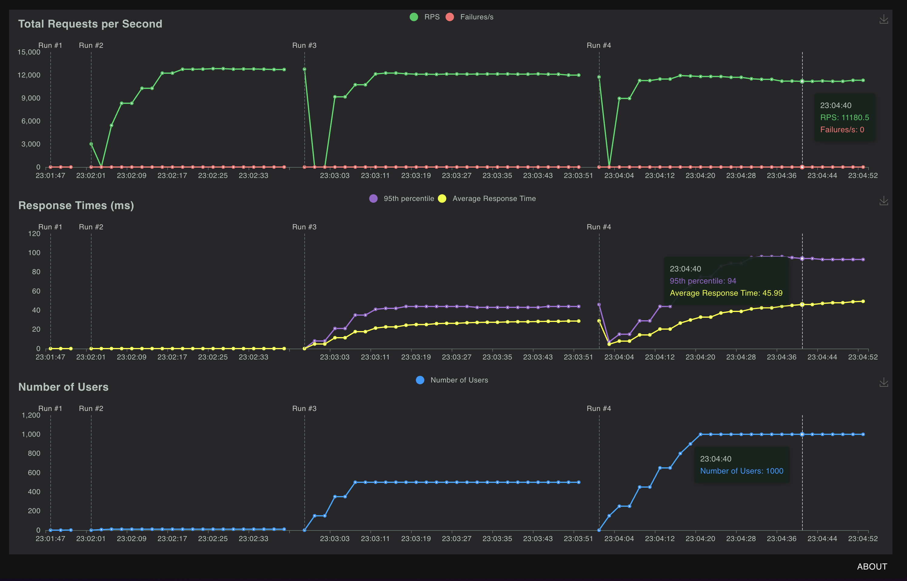
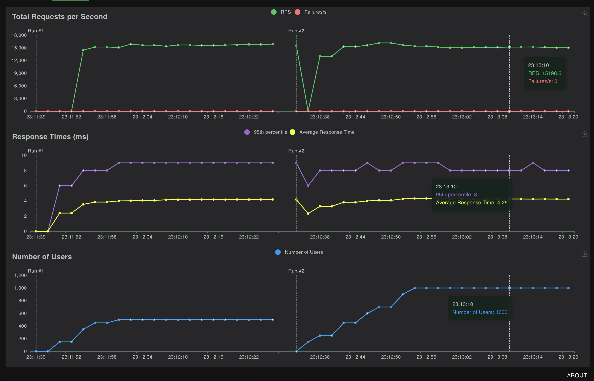
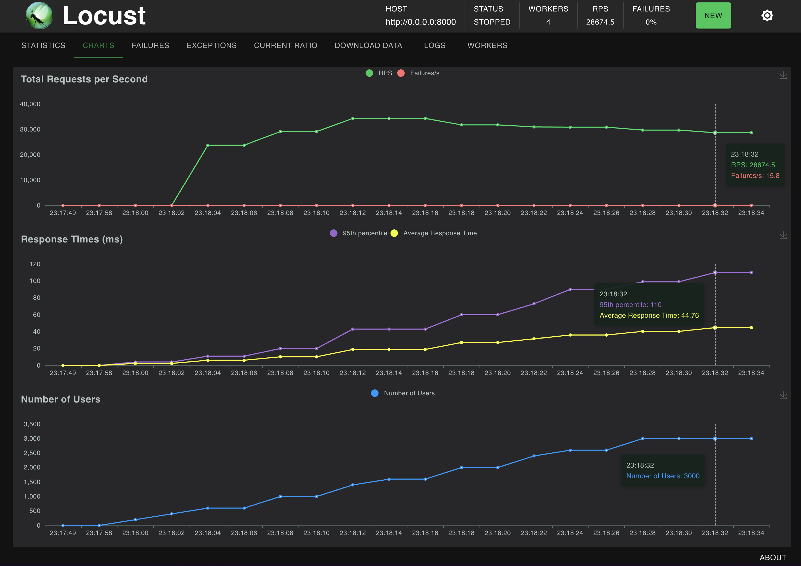
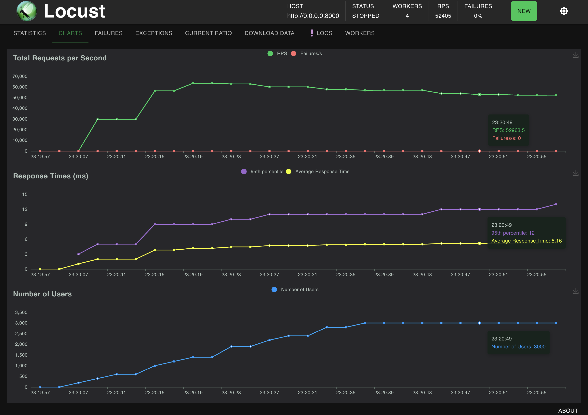

# FastApi Sanic benchmark
This is the project for **FastAPI** and **Sanic** benchmarking.
There are multiple articles that show that Sanic is about **20%-30% faster**.
But those benchmarks are general and with my benchmarks I wanted to recreate real world parameters
in np array data access.

Both APIs use **Pydantic** for parameters validation and responses unification.
There is same array predefined before start which will hols all the data.

There are 2 endpoints, one for **GET** requests and parameters are part of the URL.
It only gives back parameters for given row and column.
The other is **POST**, in which parameters are passed in json body and validated by **Pydantic**.
Also, those parameters accept a multiplier and accessed value is multiplied by it before response.

# Results

## Conclusions
In **single worker** mode **Sanic** was able to withstand **33% higher RPS** while in
**3 worker**s mode **Sanic** was able to withstand **83% higher RPS**.
(Note that those test were ran on local laptop and might differ on different hardware)

In both modes **Sanic** had **10 times lower response time**.

Main hypotheses on why Sanic is faster is that it is more lightweight and uses faster serialization algorithm.
**FastAPI** is slower due to higher amount of features. If we take **Starlette** (on which **FastAPI** is based)
it is faster than **Sanic**.

But with all additional features, it makes **FastAPi**, on average, **30% slower than Sanic**

## 1 Worker
App was booted with single worker configuration, **locust** also had only 1 process.

### FastAPI
Parameters:
- Number of users - 1000
- Total RPS - 11532.96
- Avg Response time - 46 ms
- 95th percentile Response time - 95 ms

### Sanic
Parameters:
- Number of users - 1000
- Total RPS - 15389.16
- Avg Response time - 4.25 ms
- 95th percentile Response time - 8 ms

## 3 Workers
App was booted with 3 workers configuration, **locust** had only 4 processes.

### FastAPI
Parameters:
- Number of users - 3000
- Total RPS - 30750.20
- Avg Response time - 45 ms
- 95th percentile Response time - 110 ms

### Sanic
Parameters:
- Number of users - 3000
- Total RPS - 56187.22
- Avg Response time - 5.2 ms
- 95th percentile Response time - 12 ms

